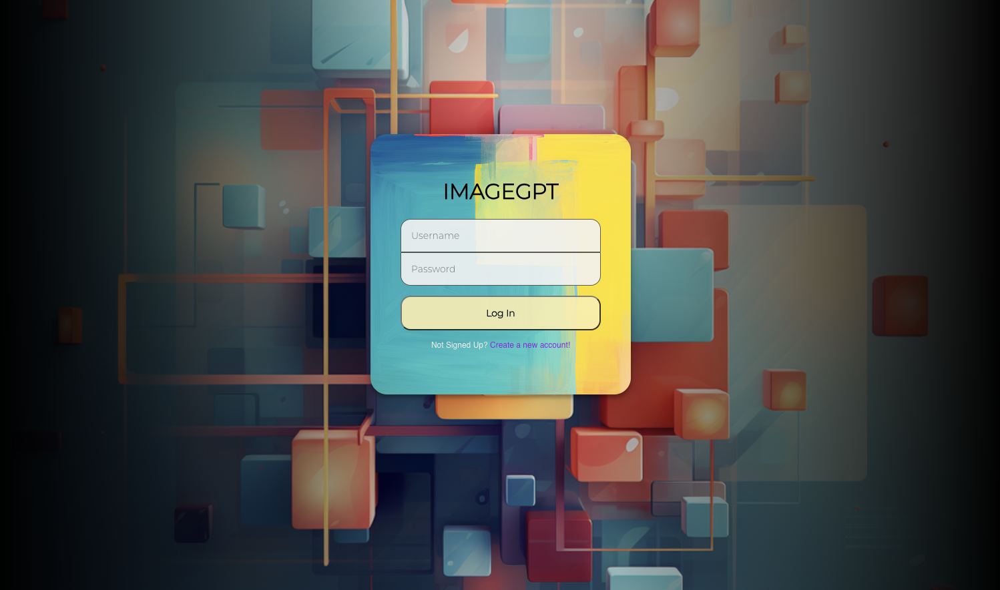
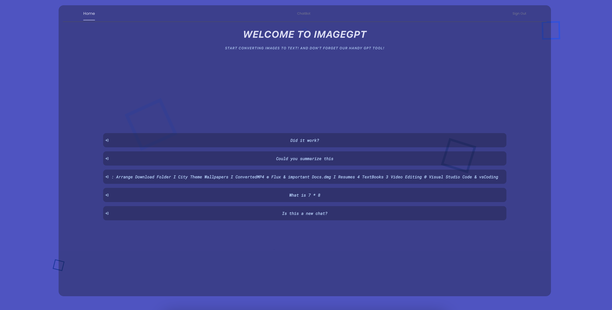
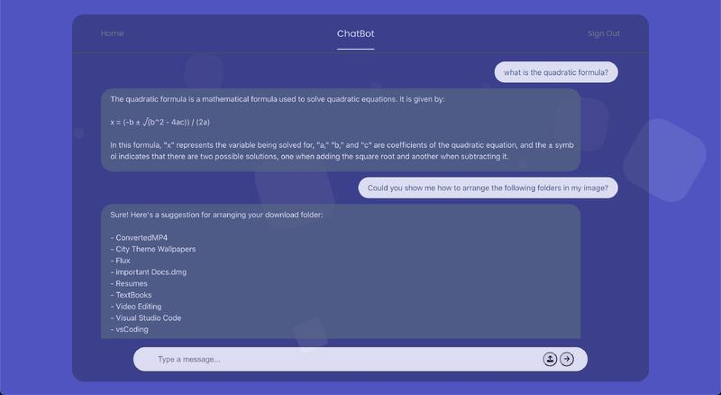

# ImageGPT: Image to Text AI Powered Chatbot

## Table of Contents

- [Introduction](#introduction)
- [Live Demo](#live-demo)
- [Features](#features)
- [Tools and Frameworks Used](#tools-and-frameworks-used)
- [Contributing](#contributing)
- [Credits](#credits)
- [Contact](#contact)
- [Acknowledgements](#acknowledgements)

## Introduction

ImageGPT is an Image to Text AI Powered Chatbot. We utilized Python Tesseract OCR coupled with OpenAI's API to provide a chatbot identical to OpenAI with a twist! (as of 2022). User's can upload photo images processed with our chatbot and ask questions right along with it.

## Live Demo

To experience this:

1. Clone the repository
2. cd into the backend directory
3. Run "flask run" on your terminal within the directory
4. Open a new tab in terminal
5. Run "npm start"
6. Navigate into your local browser port 3000
7. Enjoy!

## Features

### Login Page

Using Auth0 for authentication, users can create an account and login to enjoy our service!

### Home Page

This page contains all the previous conversation logs of the users with our chat bot! Navigate to the conversation you want or simply press "ChatBot" on the top navigation bar to create a new conversation! To sign out, simply press sign out on our top navigation bar.

### Chat Page

Conversation page with ImageGPT, upload pictures with the upload button presented next to the chat box.

## Tools and Frameworks Used:

- **React.js**: Our core framework used to build the front-end user interface.
- **HTML/SCSS**: Markup and styling languages used for creating web pages with styled components.
- **APIs: OpenAI, Tesseract OCR** Technologies used to to generate responses with our chat bot.
- **Flask**: Our backend framework storing user's data and previous conversations.

## Contributing

Contributions are what make the open source community such an amazing place to learn, inspire, and create. Any contributions you make are greatly appreciated.

1. Fork the Project
2. Create your Feature Branch (git checkout -b feature/AmazingFeature)
3. Commit your Changes (git commit -m 'Add some AmazingFeature')
4. Push to the Branch (git push origin feature/AmazingFeature)
5. Open a Pull Request

## Credits

- **Frontend**: Teeranade Cheng (Win): <a href="https://github.com/winzamark123" target = "_blank"> Github Link </a>
- **Backend**: Steven Gong <a href="https://github.com/Roszillary" target = "_blank"> Github Link </a>
- **Full-Stack**: Ray Tam<a href="https://github.com/hdjekso" target = "_blank"> Github Link </a>
- **Tesseract OCR**: Thanh To <a href="https://github.com/thanhyto" target = "_blank"> Github Link </a>
- **OpenAI API**: Teeranade Cheng (Win) <a href="https://github.com/winzamark123" target = "_blank"> Github Link </a>

## Acknowledgements

Special thanks to everyone who has provided feedback and contributions to the project. This is a project made under Google Developer Student Club @ UCDavis.
